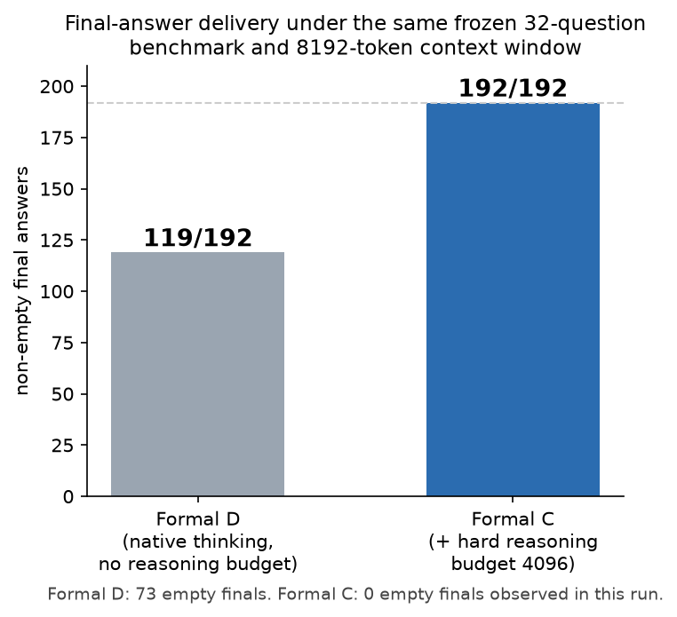
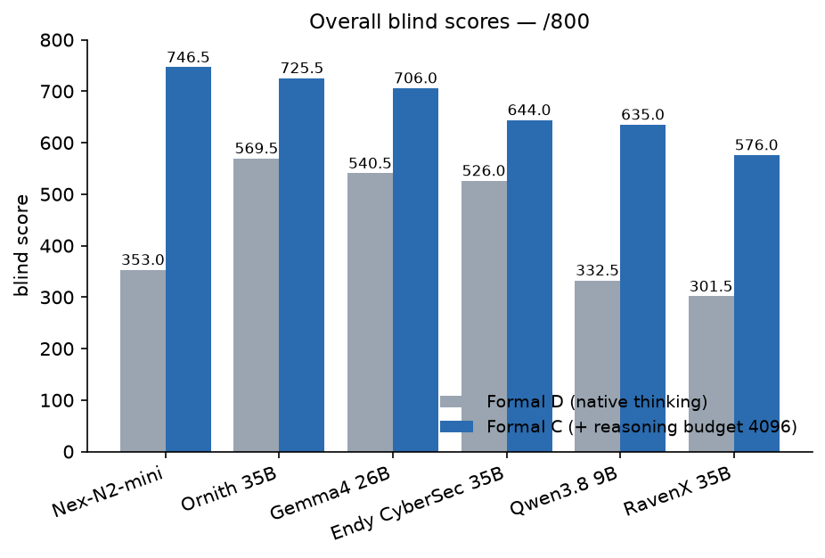
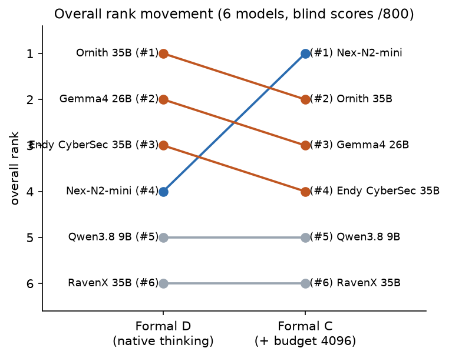
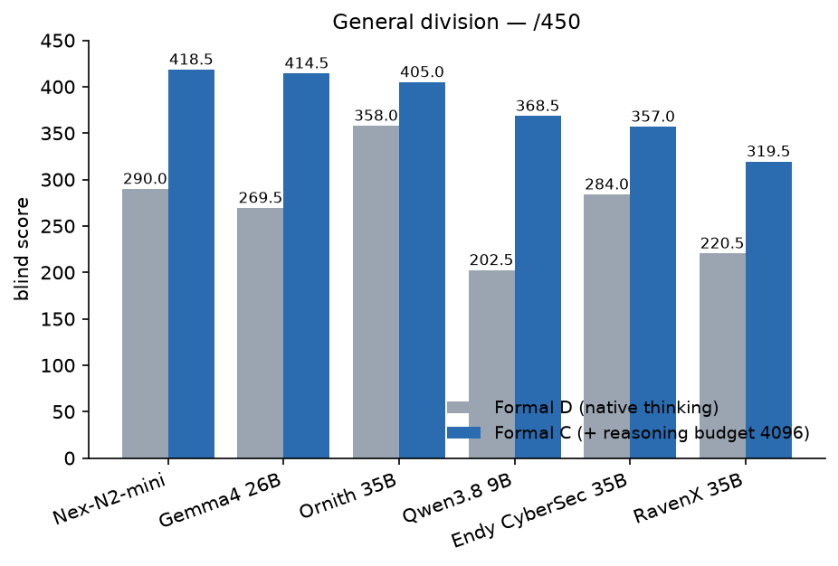
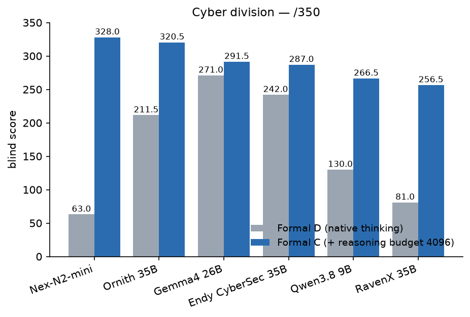

# Reasoning Budget Arena

**A Living Benchmark for Local Models: Reasoning · Capability · Latency**

Reasoning Budget Arena began as a six-model comparison of native reasoning
versus a fixed 4096-token reasoning budget. It now serves as a living
evaluation framework for local models, combining:

- frozen capability benchmarks
- post-release model extensions
- responsiveness measurements
- context-stability testing

The original six-model experiment remains **immutable** (frozen questions,
locked scores, frozen rankings). New models are added as **independent
post-release extensions** and appear on a separate
[rolling leaderboard](#rolling-formal-c-extension-ranking) that never
modifies the original locked ranking.

## Foundational experiment (frozen benchmark)

*Final-answer delivery and ranking differences under two reasoning policies —
a six-model local-LLM comparison.*

A local-LLM evaluation of two protocol conditions. The same six models answered
the same frozen 32-question benchmark under the same target 8192-token server
context window and closely matched sampling/runtime settings. The conditions
differed in reasoning policy: Formal D used each model's native/default
thinking with no separate budget; Formal C additionally configured a uniform,
hard, backend-enforced **reasoning budget of 4096 tokens**.

The comparison is **exploratory and closely matched, not a strict
single-variable controlled experiment**: Formal D's published baseline is a
composite (29-question 8192 probe + a later 3-question supplement), while
Formal C was one complete 32-question run. Differences below are therefore
*observed under the two protocols*, not claims that the budget *caused* them
(see METHODOLOGY.md §2).

## Status

**PUBLISHED — PUBLIC RELEASE + OUTPUT DATASET ADDENDUM (local, pending tag).**
All data and engineering checks are verified; the maintainer's license decision
is made (MIT + CC BY 4.0); the final release gate passed with P0 = 0, P1 = 0
(RELEASE-READINESS.md). As of 2026-09-03 the partial final-answer dataset
addendum is applied: C/D/E/F final answers are public, A/B remain withheld
(see [Final-answer dataset](#final-answer-dataset)). Documented non-blocking
limitations (unrecoverable current-fact URLs) remain noted in
LIMITATIONS.md.

## Key result (observed under the two protocols)

| | Formal D (native thinking) | Formal C (+ budget 4096) |
|---|---|---|
| non-empty final answers | **119 / 192 (61.98%)** | **192 / 192 (100%)** |
| empty finals | 73 / 192 | 0 / 192 |
| structurally clean finals | 115 / 192 | 184 / 192 (95.8%) |
| overall #1 (blind score /800) | Ornith 569.5 | **Nex 746.5** |




- Under this frozen protocol, the fixed-budget condition was followed by
  **0 empty final answers where the native-thinking condition had 73**.
- Every model scored higher in the fixed-budget condition. The largest overall
  score increase was **Nex (+393.5, rank #4 → #1)**; the next two largest
  (Qwen 9B +302.5, RavenX +274.5) were associated with **no** rank change,
  since those models also started furthest behind.
- **Neither of the two Cyber-branded models placed in the top three of the
  14-question Cyber division** in the fixed-budget condition.
- The failure mode did not disappear — it appears to have shifted: 73 empty
  finals became 6 content-channel loops + 2 context-truncated answers.
- Archived project artifacts record that the blind scores were locked before
  identity reveal (`blind/FORMAL-{D,C}-BLIND-SCORES-LOCKED.md`).

## The two protocol conditions

```
        same 6 models · same final frozen 32 questions
        target ctx 8192 · temp 0.1 · top_p 0.9
        same llama.cpp runtime · one server at a time
                        │
        ┌───────────────┴───────────────┐
        ▼                               ▼
  FORMAL D                        FORMAL C
  native/default thinking        native thinking
  (no reasoning budget)          + --reasoning-budget 4096
  composite baseline:            one contiguous 32-question run:
  29Q probe + 3Q supplement      all 192 responses in one pass
  192 responses (final set)      192 responses
```

Execution histories are **not identical** (Formal D composite; Formal C
contiguous) even though the final question set and target settings match —
see METHODOLOGY.md §3–§4.

## Models

Six local GGUF models (Q4_K_M): two cyber-focused 35B-A3B fine-tunes, a
Gemma4-class 26B-A4B MoE, two more 35B-A3B-class MoE fine-tunes, and a ~9B
dense model — run on llama.cpp b10375 with MoE experts on CPU (RTX 5060
Laptop 8 GiB). Identity/quantization/upstream sources:
[MODEL-CARDS.md](MODEL-CARDS.md), [MODEL-SOURCE-TODO.md](MODEL-SOURCE-TODO.md);
SHA256 evidence: [MODEL-ARTIFACT-MANIFEST.md](MODEL-ARTIFACT-MANIFEST.md) and
`data/model-artifacts.csv`.

## Results (blind scores /800, verified from locked scorebooks)

| model | Formal D | Formal C | Δ | rank D → C |
|---|---:|---:|---:|---|
| Nex-N2-mini | 353.0 | **746.5** | +393.5 | 4 → **1** |
| Ornith-1.5-35B-A3B | **569.5** | 725.5 | +156.0 | 1 → 2 |
| Gemma4-26B-A4B | 540.5 | 706.0 | +165.5 | 2 → 3 |
| Endy-Qwen3.6-CyberSec | 526.0 | 644.0 | +118.0 | 3 → 4 |
| Qwen3.8-9B-abliterated | 332.5 | 635.0 | +302.5 | 5 → 5 |
| RavenX-CyberAgent-35B | 301.5 | 576.0 | +274.5 | 6 → 6 |


 

Full tables, division results and deltas: [RESULTS.md](RESULTS.md).

## The three limits (often confused)

| limit | value |
|---|---|
| reasoning hard budget (Formal C only) | 4096 tokens |
| request completion cap (`max_tokens`) | 8192 tokens |
| server context window (`ctx`) | 8192 tokens |

Per-response reasoning-budget usage was **not stored** by the backend
integration — the budget is known to be configured and applied uniformly, not
which individual responses hit it.

## What this does NOT prove

- Not that 4096 is an optimal or universally recommended budget.
- Not that any model is "best"; this is one 32-question benchmark, one sample
  per cell, one blind judge.
- Not a causal mechanism: the failure-mode shift is *consistent with* the
  budget's forced transition, but the design (composite D, single run, no
  seeds) cannot isolate it.
- Nothing about general cybersecurity ability from the 14-question Cyber
  division.
- No statistical significance is claimed anywhere. Full list:
  [LIMITATIONS.md](LIMITATIONS.md).

## Post-release extensions

Post-release models are evaluated under the identical frozen Formal C protocol
and published as independent extensions in
[`extensions/`](extensions/). Their scores never modify the original
six-contestant locked ranking.

**Extension 1 — Huihui Nex N2 Mini Abliterated Q4_K_M**
(`quant-mind/Huihui-Nex-N2-mini-abliterated-GGUF`, frozen revision
`22be29be9d6908060502f4ac984650a917afdbe6`):

- Overall (Formal C Extension, blind, locked): **669.5 / 800 (83.69%)**
  — General 395.0 / 450 (87.78%), Cyber 274.5 / 350 (78.43%)
- Generation median: **40.51 t/s**
- See [extensions/huihui-nex-n2-mini-abliterated-q4](extensions/huihui-nex-n2-mini-abliterated-q4/).

**Extension 2 — Ornith-1.5-35B-A3B-Uncensored Q4_K_M (0xKitkat)**
(`0xKitkat/Ornith-1.5-35B-A3B-Uncensored-GGUF`, pinned revision
`ab0eed77c73880afda789a3914003db2273fd64a`) — blind contestant ZD74,
identity mapped only after score lock:

- Overall (Formal C Extension, blind, locked): **672.0 / 800 (84.00%)**
  — General 397.5 / 450 (88.33%), Cyber 274.5 / 350 (78.43%)
- Verdict: **EVALUATED — NOT RETAINED FOR LOCAL DEPLOYMENT** — a useful
  negative/selection result: General stayed close to Old Ornith (−7.5),
  Cyber regressed substantially (−46.0), and the practical role overlaps the
  existing Huihui/Nex options.
- See [extensions/ornith-0xkitkat-uncensored-q4](extensions/ornith-0xkitkat-uncensored-q4/).

## Rolling Formal C Extension Ranking

Comparative view across the frozen six-model field plus all post-release
Formal C extensions (8 models). **This rolling ranking does NOT modify the
original locked six-model ranking**, which remains available unchanged in
[RESULTS.md](RESULTS.md) and the locked scorebooks.

| rank | model | General /450 | Cyber /350 | Overall /800 | scope | deployment status |
|---:|---|---:|---:|---:|---|---|
| 1 | Nex-N2-mini | 418.5 | 328.0 | **746.5** | frozen field | — |
| 2 | Ornith-1.5-35B-A3B-Abliterated (Old Ornith) | 405.0 | 320.5 | 725.5 | frozen field | retained |
| 3 | Gemma4-26B-A4B-…-HauhauCS-Balanced | 414.5 | 291.5 | 706.0 | frozen field | retained |
| 4 | **Ornith-1.5-35B-A3B-Uncensored (0xKitkat, ext)** | 397.5 | 274.5 | **672.0** | extension H | not retained |
| 5 | Huihui-Nex-N2-mini-abliterated (ext) | 395.0 | 274.5 | 669.5 | extension G | retained |
| 6 | Endy-Qwen3.6-CyberSec-35B-A3B | 357.0 | 287.0 | 644.0 | frozen field | — |
| 7 | Qwen3.8-9B-abliterated-25 | 368.5 | 266.5 | 635.0 | frozen field | — |
| 8 | RavenX-CyberAgent-35B-v5.1 | 319.5 | 256.5 | 576.0 | frozen field | — |

Tie handling: the two extensions tie on Cyber (274.5) — both share rank 5
(competition ranking; the next model ranks 7). Division ranks for the new
extension: General **#4/8**, Cyber **tied #5/8**, Overall **#4/8**.

## Subjective observations

> **A note on subjective evaluation:** Some qualities—particularly uncensored behavior and natural Chinese conversational style—are difficult to evaluate rigorously with a simple benchmark. Qualities such as what users often call an "AI-like" tone are especially hard to operationalize: if a model can reliably recognize and avoid those characteristics, the phenomenon itself becomes difficult to measure directly, while manually judging every response myself would introduce substantial evaluator bias. The observations below are therefore intentionally presented as anecdotal impressions rather than formal benchmark results.
>
> **Uncensoring — subjective observation:** In my own informal manual testing, the PocketAiHub Ornith-1.5-35B-A3B-Abliterated variant did not feel meaningfully "uncensored" in practice and still refused many of the prompts I actually cared about. By contrast, the Gemma variant I use and Huihui Nex performed much better for my use case. This is a personal observation, not a formal benchmark result.
>
> **Chinese conversation — subjective observation:** During brief manual use, I subjectively found the Chinese conversational quality of Huihui Nex noticeably stronger than the Gemma 26B variant I currently use locally. This is an anecdotal observation rather than a formal benchmark result.

## Reproduce

See [REPRODUCIBILITY.md](REPRODUCIBILITY.md), including the clean-room path
test (`scripts/test_release_paths.py`). Short version: fill
`scripts/CONFIG.json`, run `python scripts/run_formal_c.py`, then
`formal_c_objective.py`, `validate_scores.py`, `make_figures.py`.

## Full report

[REPORT.md](REPORT.md). Timeline, calibration history, failure modes,
current-fact references, runtime evidence: [docs/](docs).

## Final-answer dataset

**Partial release (Output Dataset Addendum, 2026-09-03):** verbatim final
answers are public for **4 of the 6** models, split per model and per
condition under [`data/model-answers/`](data/model-answers/):

| model | Formal C | Formal D | total | status |
|---|---:|---:|---:|---|
| C — Gemma4-26B-A4B-QAT-Uncensored-HauhauCS-Balanced | 32 | 32 | 64 | **released** |
| D — Ornith-1.5-35B-A3B-Abliterated | 32 | 32 | 64 | **released** |
| E — Nex-N2-mini | 32 | 32 | 64 | **released** |
| F — Qwen3.8-9B-abliterated-25 | 32 | 32 | 64 | **released** |
| A — RavenX-CyberAgent-35B-v5.1 | — | — | — | withheld pending additional upstream/output-terms review |
| B — Endy-Qwen3.6-CyberSec-35B-A3B | — | — | — | withheld pending additional upstream/output-terms review |

**256 of 384 answers released; 128 withheld** (original six-model field).
In addition, the **32 Formal C final answers of each post-release extension
are public** — Huihui Nex under `data/model-answers/G-huihui-nex/` and
Ornith-1.5-35B-A3B-Uncensored (0xKitkat) under
`data/model-answers/H-ornith-0xkitkat/` — Formal C only, since neither
extension ran Formal D and neither is a contestant of the original field.

**320 public final answers are currently available across the repository:
256 belong to the original six-model field and 64 belong to the two
post-release Formal C extensions (32 each).** A/B (128) remain withheld.

Answers are byte-identical to the frozen generation artifacts (no
regeneration, no rewriting), contain final-answer text only (no reasoning
content), and remain traceable question → answer → locked score. The `model`
labels are **post-lock identity mapping (release metadata)** — the blind judge
never saw identities. See
[data/model-answers/NOTICE.md](data/model-answers/NOTICE.md) for the two
scopes, rights wording, provenance verification and schema, and
[data/model-answers/MANIFEST.md](data/model-answers/MANIFEST.md) for the
per-model manifest.

## Data

- `data/` — questions, verified score CSVs, master D-vs-C table, audited
  objective CSVs (D and C schemas documented separately), loop audits, model
  artifact hashes
- `data/model-answers/` — per-model verbatim final-answer CSVs (partial
  release: C/D/E/F public, A/B withheld — see above)
- `blind/` — frozen judge instructions + the two sanitized locked scorebooks
- Historical note: the initial release (Option B) withheld all 384 final
  answers; that decision is superseded by this partial release (see
  OUTPUT-REDISTRIBUTION-DECISION.md).

## License

- **Code:** MIT — see [LICENSE](LICENSE).
- **Documentation, benchmark questions, figures, and project-derived
  evaluation data:** [CC BY 4.0](LICENSE-DOCS-DATA.md).
- **Model-generated final-answer texts** (`data/model-answers/`): reproduced
  as benchmark/evaluation artifacts; the project makes **no ownership or
  relicensing claim** over the model-generated text itself. Upstream license
  information is listed per model in
  [data/model-answers/MANIFEST.md](data/model-answers/MANIFEST.md). A/B
  answer texts remain withheld and are not part of this repository.
- **Third-party models:** subject to their upstream licenses/terms — see
  [NOTICE.md](NOTICE.md).
