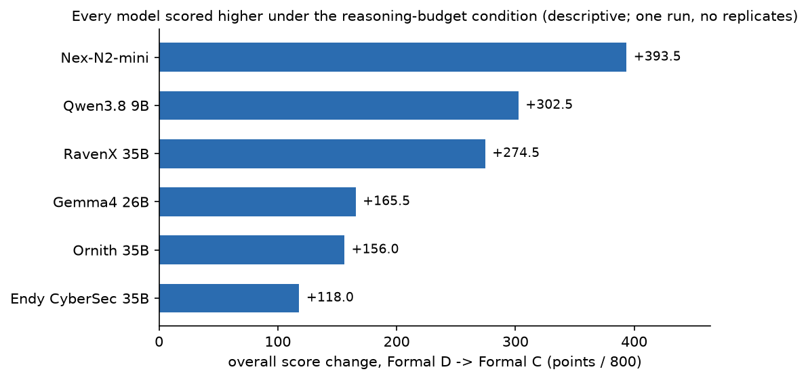

# RESULTS

All score numbers below were recomputed **from the question-level locked
scores** in `blind/FORMAL-{D,C}-BLIND-SCORES-LOCKED.md` and verified against
the artifacts' own aggregation tables (exact match) before use. Nothing here
is copied from memory or chat summaries.

Conditions are **closely matched, not identical in execution history**: Formal
D's published baseline is composite (29-question probe + G1/G8/G10 supplement;
METHODOLOGY.md §3), Formal C is one contiguous run. Differences are therefore
*observed under the two protocols*, not claims of causal attribution.

## 1. Final-answer delivery (objective)

| condition | non-empty finals | empty finals | delivery |
|---|---|---|---|
| Formal D — native thinking | 119 / 192 | 73 | **61.98%** |
| Formal C — + hard reasoning budget 4096 | 192 / 192 | 0 | **100%** |

## 2. Master table (blind scores)

Overall maximum 800 (General 450 + Cyber 350). Rank change = Formal D rank −
Formal C rank; positive means the model moved up.

| model | D Gen | C Gen | Δ Gen | D Cyber | C Cyber | Δ Cyber | D Overall | C Overall | Δ Overall | D rank | C rank | rank Δ |
|---|---:|---:|---:|---:|---:|---:|---:|---:|---:|---:|---:|---:|
| Nex-N2-mini | 290.0 | 418.5 | +128.5 | 63.0 | 328.0 | +265.0 | 353.0 | **746.5** | **+393.5** | 4 | 1 | **+3** |
| Ornith-1.5-35B-A3B | 358.0 | 405.0 | +47.0 | 211.5 | 320.5 | +109.0 | 569.5 | 725.5 | +156.0 | 1 | 2 | −1 |
| Gemma4-26B-A4B | 269.5 | 414.5 | +145.0 | 271.0 | 291.5 | +20.5 | 540.5 | 706.0 | +165.5 | 2 | 3 | −1 |
| Endy-Qwen3.6-CyberSec | 284.0 | 357.0 | +73.0 | 242.0 | 287.0 | +45.0 | 526.0 | 644.0 | +118.0 | 3 | 4 | −1 |
| Qwen3.8-9B-abliterated | 202.5 | 368.5 | +166.0 | 130.0 | 266.5 | +136.5 | 332.5 | 635.0 | +302.5 | 5 | 5 | 0 |
| RavenX-CyberAgent-35B | 220.5 | 319.5 | +99.0 | 81.0 | 256.5 | +175.5 | 301.5 | 576.0 | +274.5 | 6 | 6 | 0 |

Generated automatically into `data/d-vs-c.csv`.

### Absolute improvement vs rank movement

Every model scored higher under Formal C. The largest absolute gains (Qwen 9B
+302.5, RavenX +274.5) did **not** change those models' overall rank, because
they were also the two models that started furthest behind. The only rank
change at the top was **Nex moving from #4 to #1**; the three models ranked
1–3 under Formal D each slipped one place. Absolute score improvement and rank
movement are different phenomena and are reported separately.

### Normalized view

| model | D overall % of 800 | C overall % of 800 | change (percentage points) |
|---|---:|---:|---:|
| Nex-N2-mini | 44.1% | 93.3% | +49.2 |
| Ornith-1.5-35B-A3B | 71.2% | 90.7% | +19.5 |
| Gemma4-26B-A4B | 67.6% | 88.3% | +20.7 |
| Endy-Qwen3.6-CyberSec | 65.8% | 80.5% | +14.8 |
| Qwen3.8-9B-abliterated | 41.6% | 79.4% | +37.8 |
| RavenX-CyberAgent-35B | 37.7% | 72.0% | +34.3 |

## 3. Division results

### General (/450)

| rank | Formal D | score | | Formal C | score |
|---|---|---:|---|---|---:|
| 1 | Ornith | 358.0 | | Nex | 418.5 |
| 2 | Nex | 290.0 | | Gemma4 | 414.5 |
| 3 | Endy | 284.0 | | Ornith | 405.0 |
| 4 | Gemma4 | 269.5 | | Qwen 9B | 368.5 |
| 5 | RavenX | 220.5 | | Endy | 357.0 |
| 6 | Qwen 9B | 202.5 | | RavenX | 319.5 |

### Cyber (/350)

| rank | Formal D | score | | Formal C | score |
|---|---|---:|---|---|---:|
| 1 | Gemma4 | 271.0 | | Nex | 328.0 |
| 2 | Endy | 242.0 | | Ornith | 320.5 |
| 3 | Ornith | 211.5 | | Gemma4 | 291.5 |
| 4 | Qwen 9B | 130.0 | | Endy | 287.0 |
| 5 | RavenX | 81.0 | | Qwen 9B | 266.5 |
| 6 | Nex | 63.0 | | RavenX | 256.5 |

**Neither of the two Cyber-branded models placed in the top three of the
14-question Cyber division under Formal C.** This is an observation about two
specific fine-tunes on 14 questions in one run; it is not a statement about
cybersecurity fine-tuning in general.

## 4. Structural delivery vs scored quality

Structurally clean finals (see DATA-DICTIONARY.md — not a quality measure)
alongside scored results:

| model | D finals delivered | C finals delivered | D clean finals | C clean finals |
|---|---|---|---|---|
| RavenX | 14/32 | 32/32 | 14 | 30 |
| Endy | 24/32 | 32/32 | 24 | 30 |
| Gemma4 | 25/32 | 32/32 | 24 | 31 |
| Ornith | 25/32 | 32/32 | 24 | 32 |
| Nex | 15/32 | 32/32 | 14 | 32 |
| Qwen 9B | 16/32 | 32/32 | 15 | 29 |

The models whose scored outcome changed most (Nex, Qwen 9B, RavenX) are
exactly the models that delivered fewest finals under Formal D — consistent
with delivery, not only answer quality, driving the Formal D ordering. This
pattern **suggests** that Formal D's rankings were substantially constrained by
budget management; the experiment does not isolate that mechanism.

**Selection-bias caveat:** Formal D delivered answers are conditional on
delivery — e.g. Nex has no final on 17/32 questions, so its "high average
among delivered answers" is computed over a non-random subset and does not
estimate latent quality on the missing questions. This bounds the
interpretation above; it does not remove the observation.

## 5. Failure modes (objective)

| mode | Formal D | Formal C |
|---|---|---|
| empty final | 73 | 0 |
| confirmed content-channel loops | 0 | 6 |
| context-truncated finals (non-loop) | 4 | 2 |
| context-window exhaustion (prompt+completion = 8192) | 77 | 8 |
| structurally clean finals | 115 | 184 |

See docs/FAILURE-MODE-ANALYSIS.md. All statements are descriptive: one sample
per cell, no seeds, no replicates, no statistical tests.
